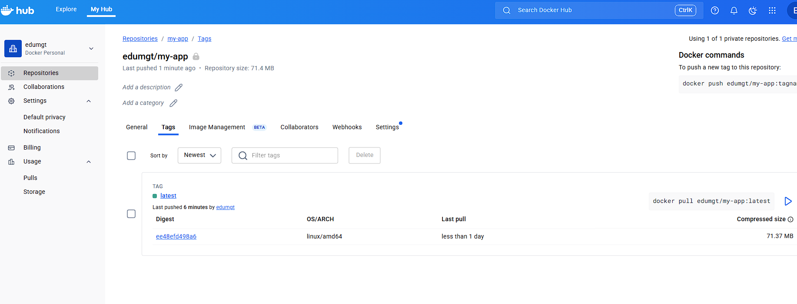
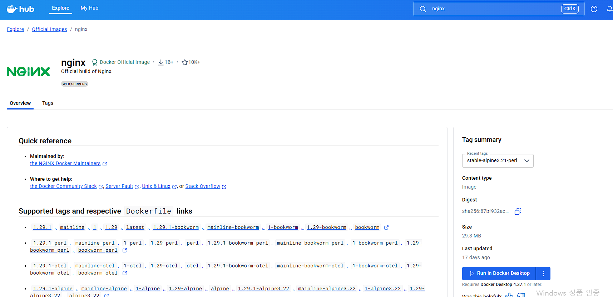

github actions 로 docker hub 연동 가능한가?
ChatGPT의 말:

네, 가능합니다 👍

GitHub Actions → Docker Hub 연동은 CI/CD 파이프라인에서 흔히 쓰이는 방식입니다. 예를 들어 코드 푸시 시 자동으로 Docker 이미지를 빌드해서 Docker Hub에 푸시할 수 있습니다.

1. Docker Hub 인증 정보 저장

GitHub 저장소의 Settings → Secrets and variables → Actions 에 들어가서 아래와 같이 추가합니다:

DOCKERHUB_USERNAME → Docker Hub 아이디

DOCKERHUB_TOKEN → Docker Hub Personal Access Token (비밀번호 대신 사용 권장)

2. GitHub Actions 워크플로우 예시
name: CI/CD with Docker Hub

on:
  push:
    branches: [ "main" ]

jobs:
  build-and-push:
    runs-on: ubuntu-latest
    steps:
      - name: Checkout Repository
        uses: actions/checkout@v3

      - name: Set up Docker Buildx
        uses: docker/setup-buildx-action@v2

      - name: Log in to Docker Hub
        uses: docker/login-action@v2
        with:
          username: ${{ secrets.DOCKERHUB_USERNAME }}
          password: ${{ secrets.DOCKERHUB_TOKEN }}

      - name: Build and Push Docker Image
        uses: docker/build-push-action@v4
        with:
          context: .
          push: true
          tags: ${{ secrets.DOCKERHUB_USERNAME }}/my-app:latest

3. 동작 방식

main 브랜치에 push 발생

GitHub Actions runner가 실행됨

코드 checkout → Docker Hub 로그인 → 이미지 빌드 후 my-app:latest 로 푸시됨

👉 이렇게 하면 GitHub → Docker Hub → (원하면) AWS/ECS/EC2 배포 까지 파이프라인 확장이 가능합니다.

원하시나요? 제가 Docker Hub → EC2 자동 배포까지 연결된 예시도 보여드릴까요?

나의 말:
Secrets
Variables 어디에?
ChatGPT의 말:

좋은 질문이에요 👍

GitHub Actions에서 Secrets 와 Variables 설정 위치는 저장소(Repository) → Settings → Secrets and variables → Actions 메뉴 안에 있습니다.

📍 경로

GitHub 저장소로 이동

Settings 탭 클릭

왼쪽 메뉴에서 Secrets and variables → Actions 선택

여기서 두 가지가 보입니다:

Secrets → 암호화된 값 (Docker Hub 토큰, API Key, 비밀번호 등)

Variables → 공개 가능한 일반 변수 (이미지 이름, 버전, 환경 이름 등)

📌 예시 구조

Secrets

DOCKERHUB_USERNAME → your-docker-id

DOCKERHUB_TOKEN → ghp_xxxxxx (Docker Hub Personal Access Token)

Variables

IMAGE_NAME → my-app

ENV → prod

🔑 차이점

Secrets

GitHub에서 암호화되어 저장됨

워크플로우 로그에 값이 그대로 찍히지 않음

보안이 중요한 값(API 키, 토큰 등) 저장용

Variables

값이 노출되어도 되는 일반 환경 변수 저장용

예: NODE_ENV=production, APP_PORT=3000

👉 즉, Docker Hub 로그인 정보(username, token)는 Secrets 에 넣고,
이미지 이름이나 환경명 같은 건 Variables 로 관리하면 됩니다.

원하시면 제가 Secrets + Variables 둘 다 활용한 GitHub Actions 예시 YAML도 작성해드릴까요?

🔒 Docker Hub PAT 사용 방법 (GitHub Actions 연동)

GitHub 저장소 → Settings → Secrets and variables → Actions → New repository secret

Name: DOCKERHUB_USERNAME → 본인 Docker Hub ID

Name: DOCKERHUB_TOKEN → 방금 복사한 PAT 값 (dckr_pat_...)

GitHub Actions 워크플로우에서 사용:

- name: Log in to Docker Hub
  uses: docker/login-action@v2
  with:
    username: ${{ secrets.DOCKERHUB_USERNAME }}
    password: ${{ secrets.DOCKERHUB_TOKEN }}

✅ 이렇게 하면 Actions 실행 시 토큰이 안전하게 사용되고, 로그에 노출되지 않습니다.

혹시 제가 Docker Hub 토큰 재발급 절차까지 정리해드릴까요?

나의 말:
ERROR: failed to build: failed to solve: failed to read dockerfile: open Dockerfile: no such file or directory
Error: buildx failed with: ERROR: failed to build: failed to solve: failed to read dockerfile: open Dockerfile: no such file or directory
ChatGPT의 말:

에러 메시지를 잘 보셨어요 👇

ERROR: failed to build: failed to solve: failed to read dockerfile: open Dockerfile: no such file or directory

➡️ 즉, Dockerfile이 현재 작업 디렉토리에 없어서 GitHub Actions에서 빌드를 못 하는 상황입니다.

🔎 원인

루트 디렉토리에 Dockerfile 없음

보통 project-root/Dockerfile 이 있어야 하는데, 없거나 이름이 다를 수 있습니다.

경로 문제

GitHub Actions docker/build-push-action 의 context 기본값은 . (현재 repo 루트)입니다.

Dockerfile이 ./docker/Dockerfile 같은 하위 폴더에 있으면 못 찾습니다.

✅ 해결 방법
1) 루트에 Dockerfile이 있는 경우

루트(./)에 Dockerfile이 있어야 합니다. 없으면 새로 만드세요:

# 예시 Dockerfile
FROM node:20-alpine
WORKDIR /app
COPY package*.json ./
RUN npm install
COPY . .
EXPOSE 3000
CMD ["npm", "start"]

GitHub Actions에서 그대로 실행됩니다:

- name: Build and Push Docker Image
  uses: docker/build-push-action@v4
  with:
    context: .
    push: true
    tags: ${{ secrets.DOCKERHUB_USERNAME }}/my-app:latest

2) Dockerfile이 다른 위치에 있을 경우

예: docker/Dockerfile 에 있을 때

- name: Build and Push Docker Image
  uses: docker/build-push-action@v4
  with:
    context: .
    file: ./docker/Dockerfile
    push: true
    tags: ${{ secrets.DOCKERHUB_USERNAME }}/my-app:latest

3) 여러 Dockerfile이 있는 경우

서비스별로 나눠져 있으면 file 옵션으로 정확히 지정해 줘야 합니다:

file: ./apps/admin/Dockerfile

👉 질문: 지금 저장소 안에 Dockerfile이 어디에 위치해 있나요?

루트에 없는 건가요, 아니면 docker/ 같은 폴더 안에 있나요?

나의 말:
------
ERROR: failed to build: failed to solve: failed to fetch oauth token: unexpected status from GET request to https://auth.docker.io/token?scope=repository%3A***%2Fmy-app%3Apull%2Cpush&service=registry.docker.io: 401 Unauthorized: access token has insufficient scopes
Error: buildx failed with: ERROR: failed to build: failed to solve: failed to fetch oauth token: unexpected status from GET request to https://auth.docker.io/token?scope=repository%3A***%2Fmy-app%3Apull%2Cpush&service=registry.docker.io: 401 Unauthorized: access token has insufficient scopes
ChatGPT의 말:

좋습니다 👍 이번엔 토큰 권한 문제네요.

에러 메시지 핵심은:

401 Unauthorized: access token has insufficient scopes

➡️ 즉, Docker Hub 로그인은 했지만 이미지 push 권한이 없는 토큰을 쓴 겁니다.

🔎 원인

Docker Hub Personal Access Token(PAT)을 만들 때
Read & Write 권한이 아닌 Read-only 로 생성했을 가능성.

tags: 부분에서 저장소 이름이 잘못되어, 토큰 소유자와 불일치.

예:

계정이 mydockerid 인데

tags: otherid/my-app:latest 로 설정했다면 권한 없음.

✅ 해결 방법
1) Docker Hub에서 올바른 토큰 만들기

Docker Hub Security Settings
 → New Access Token

Access permissions → Read & Write 선택

생성 후 복사해서 GitHub Secrets 에 DOCKERHUB_TOKEN 으로 다시 등록

2) tags 설정 확인

워크플로우에서 tags: 는 반드시 본인 계정/레포 구조여야 합니다.

tags: ${{ secrets.DOCKERHUB_USERNAME }}/my-app:latest

예:

Docker Hub 계정 → kdyops

Repository 이름 → my-app

그럼 tag 는 kdyops/my-app:latest

3) 전체 예시 (수정 버전)
- name: Log in to Docker Hub
  uses: docker/login-action@v2
  with:
    username: ${{ secrets.DOCKERHUB_USERNAME }}
    password: ${{ secrets.DOCKERHUB_TOKEN }}

- name: Build and Push Docker Image
  uses: docker/build-push-action@v4
  with:
    context: .
    push: true
    tags: ${{ secrets.DOCKERHUB_USERNAME }}/my-app:latest

## 같은 방법으로 nginx image 이용 Dockerfile 생성 및 빌드 한 순수 html 소스위주로 docker hub 에 반영
